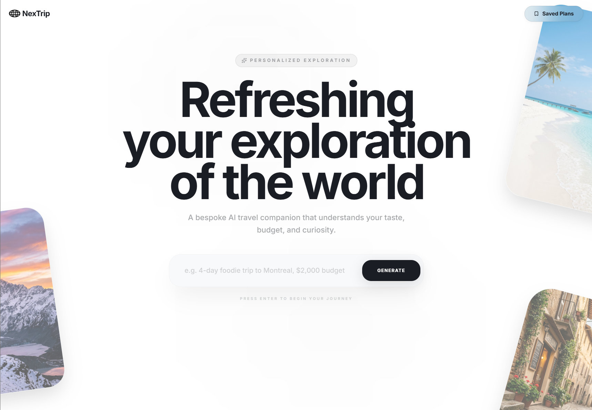
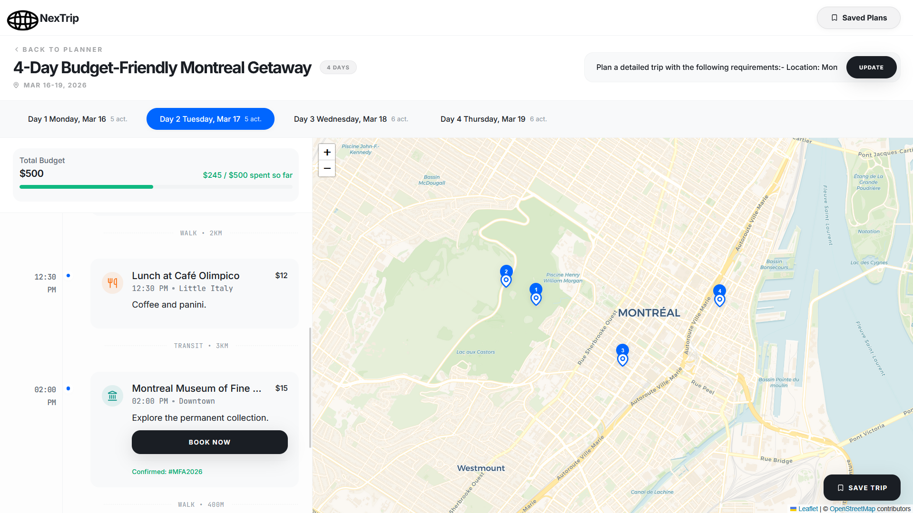

# NextTrip
<p align="center">
  Plan your NexTrip with our AI powered travel planner
</p>

<p align="center">
  
  
  
  
  
</p>

## Overview
NexTrip is an AI-powered travel planner that converts a single prompt into a complete itinerary, combining flights, hotels, events, and activities in one place.

---

## Highlights
- Full travel plans in seconds  
- Multi-API integration (flights, hotels, events)  
- Minimal, prompt-based interface  
- End-to-end flow: discovery → planning → booking  

---

## Problem
Travel planning is fragmented across platforms, requiring users to search, compare, and organize everything manually.

---

## Solution
A prompt-based system that generates structured, actionable travel itineraries from natural language input.

---

## Features
- **AI Itinerary Generation** – prompt → structured plan  
- **Conversational Input** – dynamic follow-up questions  
- **Travel Coverage** – flights, hotels, events, activities  
- **Daily Schedule** – organized itinerary  
- **Budget Overview** – cost breakdown  
- **Interactive Map** – location visualization (Leaflet)  
- **Booking Links** – direct external access  
- **Journey Management** – save and edit trips  

---

## System Flow
Prompt → AI interpretation → API calls → Data normalization → Itinerary generation → UI display  

---

## Tech Stack
- **Core:** AI model (orchestration)  
- **APIs:** Ticketmaster, AviationStack, Hotel API  
- **Frontend:** Leaflet 

## Demo

<p align="center">
  
</p>

<p align="center">
  
</p>

<p align="center">
  
</p>

---

## Challenges & Decisions
- **API Orchestration** – unified inconsistent data into a single schema  
- **UI Design** – simplified complex travel data into a clear interface  
- **AI Interaction** – balanced accuracy with minimal user friction  

---

## Impact
- Reduced planning time from hours to seconds  
- Unified multiple travel services into one platform  
- Demonstrated scalable AI + API orchestration  

---

## Roadmap
- Real-time pricing  
- Personalized recommendations  
- Budget optimization  
- Collaborative planning  
- In-app booking  

## Getting Started

```bash
git clone https://github.com/tiwoah/nextrip.git
cd nextrip
npm install
npm run dev